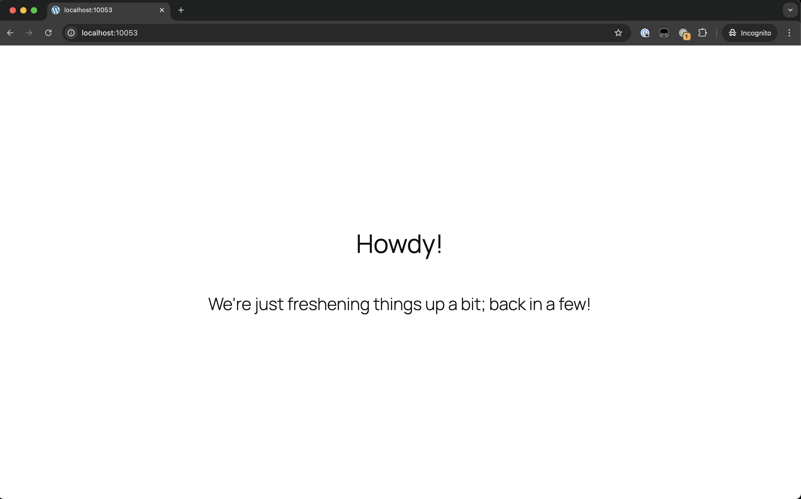
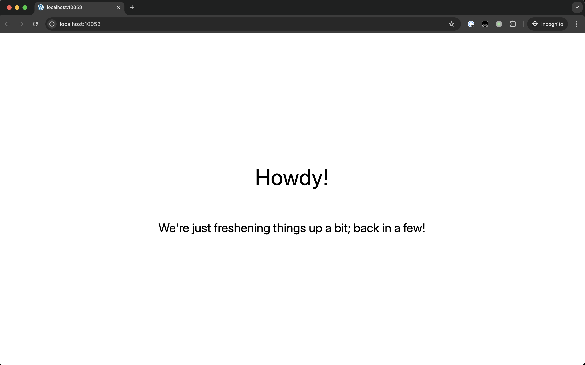
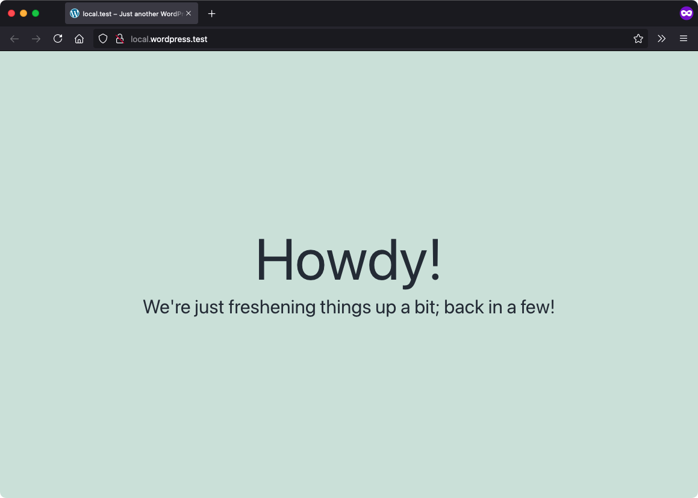
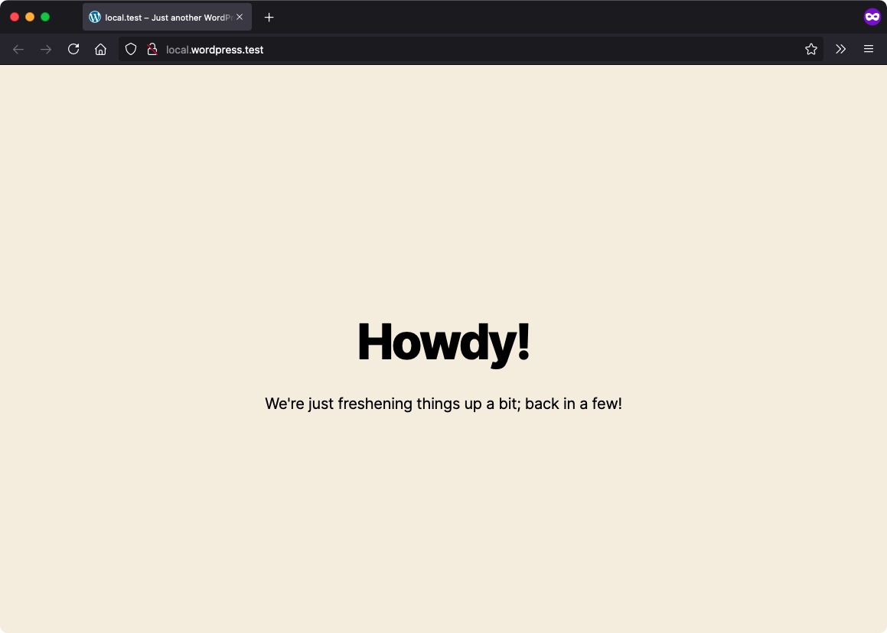
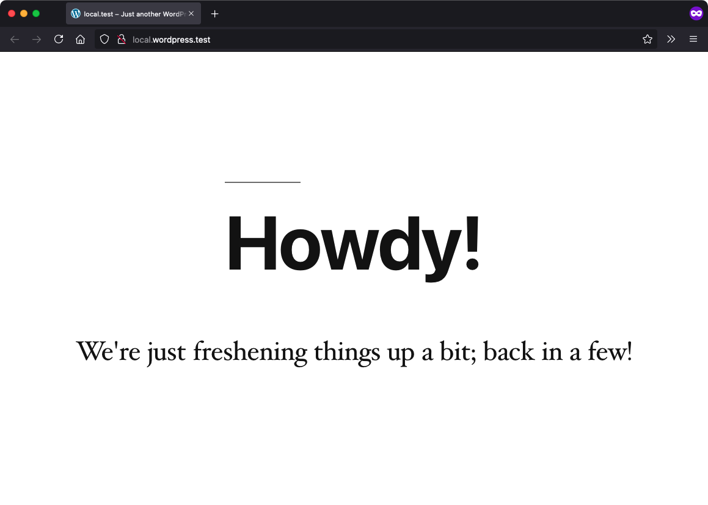

# Maintenance Mode

Stable tag: 0.3.2  
Requires at least: 5.9  
Tested up to: 6.7  
License: GPLv2 or later  
License URI: https://www.gnu.org/licenses/gpl-2.0.html  
Tags: maintenance-mode, maintenance  
Contributors: wpcomvip, automattic, benoitchantre, emrikol, philipjohn, GaryJ  

Shut down your site for a little while and do some maintenance on it!

## Description

Easily provide a holding maintenance page, including with a custom template, to site visitors. 

### Custom Template

To add a custom template and messaging:

 - Create a template in your theme's root folder named `template-maintenance-mode.php`.
 - This should be a simple HTML page that includes the message you want to show your visitors.
 - Note: the template should include `wp_head()` and `wp_footer()` calls.

You can also use the `vip_maintenance_mode_template_args` filter to adjust the file name and location of the custom template within your theme. 

For instance, if you want it to live at `wp-content/themes/my-theme/plugin-templates/maintenance-mode-alt.php`, then add code like:

~~~php
add_filter(
	'vip_maintenance_mode_template_args',
	function( $args ) {
		$args['slug'] = 'plugin-templates/maintenance-mode';
		$args['name'] = 'alt';

		return $args;
	}
);
~~~

This also allows the third array key to be used to pass in custom arguments to the template.

### Additional Configurations

Using filters and conditionals, you can customize the behavior of the Maintenance Mode plugin based on your needs. These options rely on the plugin being installed as described above.

#### Selectively Load Maintenance Mode
Configure Maintenance Mode to only display for a specific network site. Code similar to this example must be added to the `vip-config/vip-config.php` file:

~~~php
$site_name = $_SERVER['SERVER_NAME'];
$lockdown = false;

if ( false !== strpos( $site_name, 'url-to-enable-maintentance-mode' ) ) {
	// Set lockdown
	$lockdown = true;
}
// Set maintenance plugin
define( 'VIP_MAINTENANCE_MODE', $lockdown );
~~~

#### Enable WordPress REST API
Configure Maintenance Mode to keep the WordPress REST API enabled even though the rest of the site is not accessible. Note that this code should be added to a file located within the `client-mu-plugins` directory:

~~~php
// Generally allow API access
add_filter( 'vip_maintenance_mode_restrict_rest_api', '__return_false' );
~~~

You can also choose to enable the REST API only in more narrow use-cases:

~~~php
add_filter( 'vip_maintenance_mode_restrict_rest_api', 'x_mm_allow_api' );

function x_mm_allow_api( $default ) {
	if ( my_check() ) { 
		return false;
	}

	return true;
}
~~~

## Installation

1. Add the plugin to the `/plugins` directory of an application's GitHub repository.
2. Define the `VIP_MAINTENANCE_MODE` constant as true in `vip-config/vip-config.php`.
3. Activate the plugin in the WordPress Admin dashboard Plugins screen.

## Screenshots

On Twenty Twenty-Five:  

On Twenty Twenty-Four:  

On Twenty Twenty-Three:  

On Twenty Twenty-Two:  

On Twenty Twenty-One:  

On Twenty Twenty:  

On Twenty Nineteen:  

On Twenty Seventeen:  

## Changelog

See [the changelog](CHANGELOG.md).
