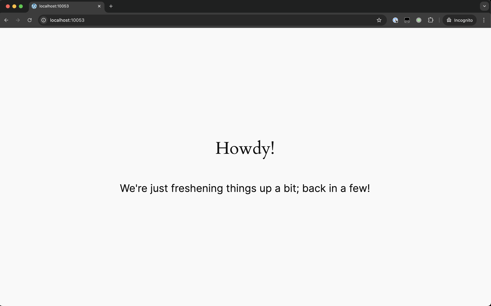
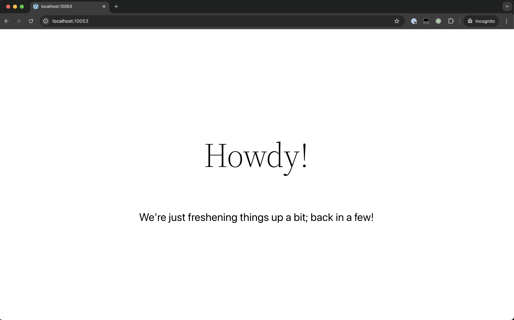

# Maintenance Mode

Shut down your site for a little while and do some maintenance on it!

## Installation and activation

1. Add the plugin to the `/plugins` directory of an application's GitHub repository.
2. Define the `VIP_MAINTENANCE_MODE` constant as true in `vip-config/vip-config.php`.
3. Activate the plugin in the WordPress Admin dashboard Plugins screen.

### Custom Template

To add a custom template and messaging:

 - Create a template in your theme's root folder named `template-maintenance-mode.php`.
 - This should be a simple HTML page that includes the message you want to show your visitors.
 - Note: the template should include `wp_head()` and `wp_footer()` calls.

### Additional Configurations

Using filters and conditionals, you can customize the behavior of the Maintenance Mode plugin based on your needs. These options rely on the plugin being installed as described above.

**Selectively Load Maintenance Mode**
Configure Maintenance Mode to only display for a specific network site. Code similar to this example must be added to the `vip-config/vip-config.php` file:

    $site_name = $_SERVER['SERVER_NAME'];
    $lockdown = false;

    if ( false !== strpos( $site_name, 'url-to-enable-maintentance-mode' ) ) {
        // Set lockdown
        $lockdown = true;
    }
    // Set maintenance plugin
    define( 'VIP_MAINTENANCE_MODE', $lockdown );

**Enable WordPress REST API**
Configure Maintenance Mode to keep the WordPress REST API enabled even though the rest of the site is not accessible. Note that this code should be added to a file located within the `client-mu-plugins` directory:

    // Generally allow API access
    add_filter( 'vip_maintenance_mode_restrict_rest_api', '__return_false' );

You can also choose to enable the REST API only in more narrow use-cases:

    add_filter( 'vip_maintenance_mode_restrict_rest_api', 'x_mm_allow_api' );

    function x_mm_allow_api( $default ) {
    	if (my_check() ) { 
                               return false;
                 }

    	return true;
    }

## Default template screenshots

On Twenty Twenty-Five:  

On Twenty Twenty-Four:  

On Twenty Twenty-Three:  

On Twenty Twenty-Two:  

On Twenty Twenty-One:  

On Twenty Twenty:  

On Twenty Nineteen:  

On Twenty Seventeen:  

## Changelog

### 0.2.2
* Stop returning a 503 to Jetpack requests to prevent broken connection verification

### 0.2.1
* Stop returning a 503 to Nagios on WPCom and VipGo to prevent alerting as a server error

### 0.2.0
* Return a 503 header while maintenance mode is active (props benoitchantre)
* Add an admin bar notice when Maintenance Mode is on (props benoitchantre)

### 0.1.0
* Initial plugin
